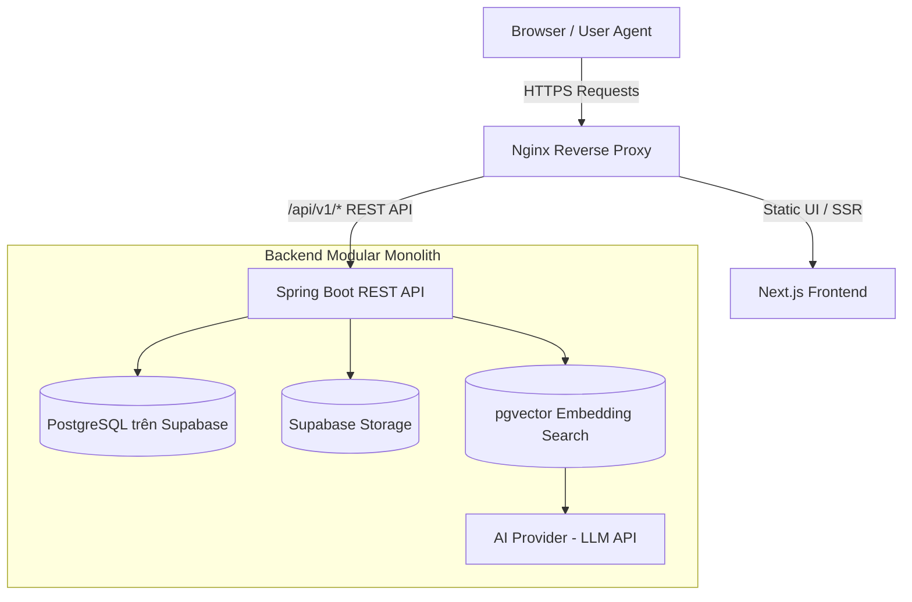
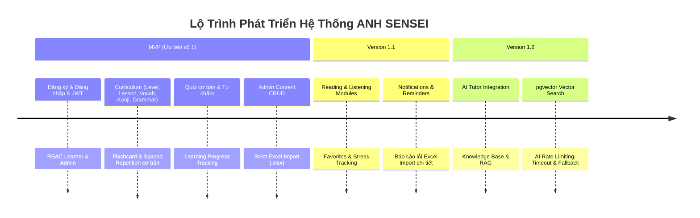

# ANH SENSEI — Nền Tảng Web Tự Học Tiếng Nhật (JLPT N5 – N3)

> Nền tảng web tự học tiếng Nhật từ JLPT N5 đến N3 tích hợp **Flashcard Spaced Repetition**, **Quiz tự động chấm**, **Quản trị nội dung**, **Strict Excel Import** và **Trợ giảng AI sử dụng RAG (Retrieval-Augmented Generation)**.

---

## 1. Thông Tin Dự Án (Project Overview)

| Hạng mục | Nội dung |
| :--- | :--- |
| **Tên hệ thống** | ANH SENSEI |
| **Loại sản phẩm** | Website responsive học tiếng Nhật (JLPT N5 – N3) |
| **Đối tượng sử dụng** | Người tự học tiếng Nhật từ cấp độ N5 đến N3 |
| **Frontend** | Next.js + TypeScript + Tailwind CSS |
| **Backend** | Spring Boot Modular Monolith |
| **API** | REST API + OpenAPI / Swagger |
| **Bảo mật** | Spring Security + JWT Access Token (15 phút) + Refresh Token (7 ngày) |
| **Database** | PostgreSQL hosted trên Supabase |
| **ORM / Migration** | Spring Data JPA / Hibernate + Flyway Community |
| **File Storage** | Supabase Storage (chỉ backend sử dụng credential đặc quyền) |
| **AI Component** | AI Tutor + RAG + pgvector (xử lý hoàn toàn tại Backend) |
| **DevOps** | Docker, Docker Compose, Nginx, GitHub Actions |
| **Monitoring** | SLF4J / Logback, Spring Boot Actuator, Prometheus, Grafana |
| **Mục tiêu chi phí** | Sử dụng công nghệ miễn phí hoặc mã nguồn mở trong giai đoạn đồ án |

---

## 2. Kiến Trúc Bắt Buộc (Architecture & Constraints)

### sơ đồ Luồng Dữ Liệu & Thành Phần



### Các Nguyên Tắc Kiến Trúc Không Được Vi Phạm

1. **Next.js chỉ gọi REST API của Spring Boot**: Frontend hoàn toàn độc lập với database và các service bên thứ ba.
2. **Tuyệt đối không kết nối trực tiếp DB từ Frontend**: Frontend không có kết nối trực tiếp đến PostgreSQL / Supabase.
3. **Bảo mật Credential tuyệt đối**: Frontend **không** lưu giữ Supabase Service Key, Database Password, JWT Signing Secret hoặc AI API Key.
4. **Không gọi trực tiếp AI Provider từ Frontend**: Mọi request AI phải thông qua Spring Boot backend để thực hiện authentication, rate limiting và logging.
5. **Single Point of Business Logic**: Spring Boot là nơi duy nhất xử lý business logic, authentication, authorization, database, file và AI integration.
6. **Modular Monolith Architecture**: Hệ thống là Modular Monolith, không tự ý tách microservices.
7. **Single Source of Truth Database**: PostgreSQL trên Supabase là database duy nhất; Supabase không đóng vai trò database thứ hai.

---

## 3. Vai Trò Người Dùng (User Roles & Permissions)

### 1. Guest (Khách)
- Xem thông tin các cấp độ (Levels) và các sample lesson đã được công bố.
- Đăng ký tài khoản, xác thực email, đăng nhập và đặt lại mật khẩu.
- *Lưu ý*: Guest là trạng thái vắng mặt authentication token, **không được lưu thành một Role trong Database**.

### 2. Learner (Học viên)
- Học các kỹ năng: Từ vựng (Vocabulary), Kanji, Ngữ pháp (Grammar), Đọc hiểu (Reading) và Nghe hiểu (Listening).
- Ôn tập Flashcard theo thuật toán lặp lại ngắt quãng (**Spaced Repetition**).
- Làm bài Quiz, nhận kết quả tự động và xem lại bài làm ở chế độ Review.
- Xem Dashboard tiến độ học tập, lịch sử hoạt động, chuỗi học tập (**Streak**), danh sách yêu thích (**Favorites**) và thông báo.
- Quản lý Hồ sơ cá nhân, thiết lập mục tiêu JLPT, Timezone và lịch nhắc học.
- Tương tác với **AI Tutor** trong phạm vi kiến thức tiếng Nhật.

### 3. Admin (Quản trị viên)
- Quản lý người dùng, khóa / mở khóa tài khoản.
- Quản lý nội dung chương trình học (CRUD, sắp xếp, publish, unpublish, archive).
- Import nội dung giáo trình hàng loạt bằng file Excel theo quy chuẩn nghiêm ngặt (**Strict Excel Import**).
- Quản lý Knowledge Base và theo dõi tiến trình indexing dữ liệu vector cho AI.
- Xem Learning Analytics, Audit Logs và Technical Logs (đã mask dữ liệu nhạy cảm).
- *Quy định riêng tư*: Admin **không được phép đọc chat riêng tư** của Learner ngoại trừ các tin nhắn được báo cáo (report) bởi người học. Mọi hành vi truy xuất đều phải ghi vết Audit Log.

---

## 4. Phạm Vi Phát Hành (Release Roadmap)



### Ngoài Phạm Vi Hiện Tại (Out of Scope)
- Native Mobile App (iOS / Android app gốc).
- Tính năng mạng xã hội / Social learning (kết bạn, forum).
- Chấm điểm phát âm tự động (Voice recognition / Pronunciation scoring).
- Nội dung N2 / N1 hoàn chỉnh.
- Import tài liệu nâng cao từ file Word (.docx).
- Hạ tầng phức tạp: Kubernetes, Apache Kafka, Elasticsearch, Microservices architecture.

---

## 5. Các Module Backend (Backend Modules & Responsibilities)

Hệ thống được thiết kế theo mô hình **Modular Monolith**. Các module giao tiếp với nhau qua Service/Interface được định nghĩa rõ ràng, **không truy cập trực tiếp Repository của module khác**.

| Module | Trách nhiệm chính |
| :--- | :--- |
| `identity` | Quản lý User, Role, xác thực authentication, cấp phát/rotate Token, khôi phục mật khẩu. |
| `curriculum` | Quản lý Level, Lesson, Vocabulary, Kanji, Grammar points và quy trình Publishing. |
| `learning` | Quản lý Tiến độ học (Progress), Nhật ký hoạt động (Activities), Chuỗi ngày học (Streak), Favorites. |
| `flashcard` | Hàng đợi ôn tập (Queue), Tiến độ Spaced Repetition, Review Logs. |
| `assessment` | Bài kiểm tra (Quiz), Ngân hàng câu hỏi (Questions), Attempts, Tự động chấm điểm, Answer Snapshot. |
| `media` | Nội dung Reading, Listening và Metadata quản lý tệp đa phương tiện. |
| `importing` | Xử lý Template, Import Job, Validation quy chuẩn, Transactional Commit và Error Report. |
| `ai` | Chat Metadata, Knowledge Documents, Text Chunking, Vector Retrieval (pgvector) & LLM Provider Integration. |
| `operations` | Cấu hình hệ thống (Configuration), Notifications, Reminders, Audit Logs, System Logs, Health & Metrics. |

---

## 6. Cơ Sở Dữ Liệu (Database Specification)

Database của dự án gồm **38 bảng** thuộc schema `public`, quản lý bằng **Flyway Migration**.

### Phân Nhóm Các Bảng Chính
- **Identity**: `roles`, `users`, `refresh_tokens`, `email_verification_tokens`, `password_reset_tokens`.
- **Curriculum**: `levels`, `lessons`, `vocabulary`, `kanji`, `lesson_kanji`, `grammar_points`, `examples`.
- **Assessment**: `quizzes`, `questions`, `question_options`, `quiz_attempts`, `quiz_attempt_answers`.
- **Learning**: `learning_progress`, `learning_activities`, `user_streaks`, `favorites`.
- **Flashcard**: `flashcard_progress`, `flashcard_review_logs`.
- **Media**: `reading_contents`, `listening_contents`.
- **Import**: `import_jobs`, `import_errors`, `import_processing_attempts`.
- **AI**: `knowledge_documents`, `knowledge_chunks`, `chat_sessions`, `chat_messages`, `message_retrieval_sources`.
- **Operations**: `notifications`, `study_reminders`, `system_configurations`, `audit_logs`, `system_logs`.

### Quy Tắc Thiết Kế & Thao Tác Database
1. **Naming Standard**: Sử dụng `snake_case` cho toàn bộ tên bảng và tên cột.
2. **Primary Key**: Tất cả các bảng chính sử dụng `BIGINT IDENTITY`.
3. **Time Standard**: Cột lưu thời gian sử dụng kiểu `TIMESTAMPTZ` và bắt buộc lưu theo chuẩn UTC.
4. **Data Retention**: Dữ liệu có lịch sử hoặc quan hệ phụ thuộc bắt buộc dùng **Soft Delete / Archive**, tuyệt đối **không Hard Delete**.
5. **Migration Control**:
   - Sử dụng Flyway để quản lý mọi thay đổi schema.
   - Tuyệt đối **không** dùng `spring.jpa.hibernate.ddl-auto=create` hoặc `create-drop`.
   - Trên staging/production dùng `spring.jpa.hibernate.ddl-auto=validate`.
6. **Polymorphic References**: Các quan hệ đa hình dùng bộ đôi `content_type` + `content_id`. Backend phải validate allowlist và kiểm tra sự tồn tại của target entity trong cùng một transaction.
7. **Storage Alignment**: Database chỉ lưu đường dẫn (URL/Path) và metadata của media; nội dung binary/file thực tế được lưu trên Supabase Storage.

---

## 7. Quy Tắc Nghiệp Vụ Quan Trọng (Core Business Rules)

### 🔐 Authentication & Security
- **Email**: Phải được trim khoảng trắng, chuyển thành lowercase và là duy nhất trong toàn hệ thống.
- **Mật khẩu**: Độ dài tối thiểu 8 ký tự, phải thỏa mãn ít nhất 3 trong 4 nhóm: chữ hoa, chữ thường, chữ số, ký tự đặc biệt.
- **Brute-force Protection**: Khóa tài khoản tạm thời 15 phút nếu nhập sai mật khẩu 5 lần liên tiếp trong vòng 15 phút.
- **Token Management**:
  - Access Token có thời hạn **15 phút**.
  - Refresh Token có thời hạn **7 ngày**, chỉ lưu dạng **hash** trong database, bắt buộc **rotate** khi cấp lại access token mới và hỗ trợ cơ chế **revoke**.
  - Thao tác Logout sẽ revoke refresh token hiện tại. Khi đổi mật khẩu hoặc bị Admin khóa tài khoản, toàn bộ refresh token đang active của user đó sẽ bị revoke lập tức.
  - User chưa xác thực email, đang bị `locked` hoặc `disabled` tuyệt đối không được cấp token mới.

### 📚 Content & Learning Progress
- **Chế độ hiển thị**: Guest chỉ xem được Level và các Sample Lesson đã `PUBLISHED`. Learner chỉ xem nội dung `PUBLISHED` và tiến độ cá nhân.
- **Điều kiện Publish Lesson**: Phải có `title`, `sort_order` duy nhất trong Level và chứa ít nhất một item học tập đã `PUBLISHED`.
- **Tự động Hoàn thành Lesson**: Lesson tự chuyển trạng thái Completed khi Learner hoàn thành toàn bộ các item bắt buộc và đạt điểm `score >= pass_score` ở tất cả các bài Quiz bắt buộc. Learner **không được phép tự gửi request đánh dấu completed** cho Lesson.
- **Tính toán Streak**: Streak chỉ được ghi nhận/cộng dồn khi có hành động học tập thực sự: hoàn thành 1 content item, submit 1 quiz (có ít nhất 1 câu trả lời) hoặc review ít nhất 1 flashcard. *Đăng nhập hoặc chỉ mở xem trang không được tính streak*.

### 🗂️ Flashcard & Spaced Repetition
- **Hàng đợi ôn tập**: Card được tính là đến hạn ôn tập khi `next_review_at <= current UTC time`.
- **Đánh giá Spaced Repetition**: Chấp nhận 4 mức rating: `AGAIN`, `HARD`, `GOOD`, `EASY`.
- **Log Lịch sử**: Mỗi lần review phải ghi nhận `previous_interval`, `new_interval` và `algorithm_version`.
- **Reset Tiến độ**: Hành động Reset progress chỉ ảnh hưởng tới dữ liệu cá nhân của người yêu cầu; không xóa dữ liệu nội dung hoặc review log lịch sử.

### 📝 Assessment & Quiz
- **Tạo Attempt**: Chỉ cho phép tạo attempt với các bài Quiz ở trạng thái `PUBLISHED`.
- **Submit Idempotency**: Quá trình submit chuyển trạng thái attempt từ `IN_PROGRESS` $\rightarrow$ `SUBMITTED` đúng 1 lần. Mọi request submit lặp lại phải đảm bảo tính **idempotent**.
- **Điểm số**: Calculated score = $(\text{earned weight} / \text{available weight}) \times 100$, làm tròn 2 chữ số thập phân.
- **Answer Snapshot**: Tại thời điểm submit, backend bắt buộc lưu cố định snapshot của prompt, user answer, correct answer và explanation. Điểm của attempt cũ không bị thay đổi nếu sau đó Admin cập nhật lại nội dung câu hỏi.
- **Chế độ Review**: Hỗ trợ 4 chế độ review bài làm: `IMMEDIATE`, `AFTER_DEADLINE`, `AFTER_MAX_ATTEMPTS`, `NEVER`.

### 📊 Strict Excel Import (Admin)
- **Quy chuẩn File**: Chỉ nhận định dạng `.xlsx`, dung lượng tối đa **10 MB** và tối đa **1.000 dòng**.
- **Quy trình 2 Bước**: Bắt buộc Upload $\rightarrow$ Preview / Validate $\rightarrow$ Commit.
- **Chính sách Lỗi**: Nếu xuất hiện dù **chỉ 1 dòng invalid**, hệ thống chặn toàn bộ tiến trình commit.
- **Báo cáo Lỗi**: File báo cáo lỗi phải chỉ rõ row number, column name, field name và lý do lỗi cụ thể.
- **Duplicate Mode**: Phải chọn chế độ xử lý trùng trước khi validate: `SKIP` hoặc `UPDATE`.
- **Transaction Safety**: Commit toàn bộ job trong một Database Transaction duy nhất; gặp lỗi kỹ thuật phải **rollback toàn bộ**.
- **Trạng thái Mặc định**: Nội dung được import luôn ở trạng thái `DRAFT`, không tự động publish.
- **Retry**: Thao tác retry phải khởi tạo một processing attempt mới và duy trì lịch sử audit.

### 🤖 AI Tutor & RAG
- **Phạm vi Trả lời**: Chỉ tư vấn và hỗ trợ học tiếng Nhật, tuyệt đối không tự sửa dữ liệu giáo trình.
- **Rate Limiting**: Giới hạn tối đa **5 requests/phút** (sliding window), **20 requests/ngày** (giờ địa phương) và tối đa **1 request đang xử lý** cho mỗi learner.
- **Timeout & Fallback**: Hard timeout cho AI Provider là **15 giây**. Nếu AI gặp lỗi hoặc timeout, trả về tin nhắn fallback. Mọi chức năng chính (Lesson, Quiz, Flashcard) phải tiếp tục hoạt động bình thường mà không bị ảnh hưởng.
- **Retrieval Security**: Chỉ thực hiện retrieval trên các Knowledge Document có `approval_status = APPROVED` và `index_status = INDEXED`.

---

## 8. Quy Ước REST API & Response Format

### Base Path
```text
/api/v1
```

### Ví Dụ Các Endpoints Chuẩn

```text
POST   /api/v1/auth/register
POST   /api/v1/auth/login
POST   /api/v1/auth/refresh
POST   /api/v1/auth/logout
GET    /api/v1/levels
GET    /api/v1/lessons/{lessonId}
GET    /api/v1/flashcards/review-queue
POST   /api/v1/flashcards/{contentType}/{contentId}/reviews
POST   /api/v1/quizzes/{quizId}/attempts
POST   /api/v1/quiz-attempts/{attemptId}/submit
POST   /api/v1/admin/import-jobs
POST   /api/v1/admin/import-jobs/{jobId}/validate
POST   /api/v1/admin/import-jobs/{jobId}/commit
POST   /api/v1/ai/chat-sessions/{sessionId}/messages
```

### Format Trả Lỗi Chuẩn (Standard Error Response JSON)

```json
{
  "timestamp": "2026-08-20T15:00:00Z",
  "status": 400,
  "code": "VALIDATION_ERROR",
  "message": "Dữ liệu không hợp lệ",
  "fieldErrors": [
    { 
      "field": "email", 
      "message": "Email không đúng định dạng" 
    }
  ],
  "correlationId": "e4a7b9c2-5d1f-4c8a-9e3b-7f1a2b3c4d5e"
}
```

> **Lưu ý**: Tuyệt đối **không trả entity JPA trực tiếp** ra API. Bắt buộc dùng Request/Response DTO và validate đầu vào rõ ràng.

---

## 9. Bảo Mật Và Quản Lý Secret

Các giá trị nhạy cảm **chỉ được phép lưu trong Environment Variables** hoặc CI/CD Secrets:

```bash
DATABASE_URL
DATABASE_USERNAME
DATABASE_PASSWORD
JWT_SIGNING_SECRET
SUPABASE_URL
SUPABASE_SERVICE_KEY
AI_API_KEY
```

⚠️ **Quy tắc An toàn**:
- Không bao giờ commit file `.env`, mật khẩu, access token, refresh token, service key hoặc API key lên Git repository.
- Không bao giờ ghi các giá trị bí mật này vào log hoặc trong API response.

---

## 10. Cấu Hình Spring Boot Tham Khảo

### `application.properties` Mẫu

```properties
# Spring Datasource Configuration
spring.datasource.url=${DATABASE_URL}
spring.datasource.username=${DATABASE_USERNAME}
spring.datasource.password=${DATABASE_PASSWORD}

# JPA & Hibernate Settings
spring.jpa.hibernate.ddl-auto=validate
spring.jpa.open-in-view=false

# Flyway Database Migration
spring.flyway.enabled=true
```

### Định Dạng JDBC URL Cho Supabase PostgreSQL
```text
jdbc:postgresql://<HOST>:5432/postgres?sslmode=require
```

---

## 11. Quy Ước Viết Code (Coding Standards)

### Backend (Spring Boot & Java)
- Package đặt tên dạng chữ thường (`lowercase`).
- Tên Class dùng `PascalCase`; Tên Method/Variable dùng `camelCase`.
- Tách bạch cấu trúc trong từng module: `controller`, `dto`, `service`, `repository`, `entity`, `mapper`, `exception`.
- **Layer Responsibilities**:
  - `Controller`: Chỉ nhận request, validate cơ bản, chuyển giao cho service và trả response.
  - `Service`: Chứa toàn bộ business rules và domain logic.
  - `Repository`: Chỉ đảm nhận việc tương tác database persistence.
- Đánh dấu `@Transactional` tại Service layer đối với các use cases ghi dữ liệu (write operations).
- Sử dụng Global Exception Handler (`@ControllerAdvice`) để chuẩn hóa error responses.
- **Tránh Lombok `@Data` cho JPA Entity**: Tránh đưa các mối quan hệ hai chiều vào `toString()`, `equals()` và `hashCode()` để ngăn chặn lỗi lặp vô tận / StackOverflowError.

### Frontend (Next.js & TypeScript)
- Bật `strict` mode trong TypeScript; **không sử dụng `any`** ngoại trừ trường hợp bất khả kháng.
- Quản lý Server State tập trung thông qua một API Client duy nhất.
- UI Components tuyệt đối không chứa business rules của Backend.
- Phải thiết kế đầy đủ các trạng thái UI: `loading`, `empty`, `error` và `unauthorized`.
- Đảm bảo Responsive Design chuẩn trên 3 điểm ngắt (breakpoints): **360px** (Mobile), **768px** (Tablet), và **1280px** (Desktop).

### Palette Màu Sắc Giao Diện (Color Palette)
- **Nền chính (Background)**: `#F5EFE6` (Be sáng)
- **Màu chủ đạo (Primary)**: `#8B6F5A` (Nâu đất)
- **Màu nhấn (Accent)**: `#C65D4B` (Đỏ gạch)

---

## 12. Chiến Lược Kiểm Thử (Testing Strategy)

### Backend Testing
- **Unit Test**: JUnit 5 + Mockito.
- **Integration Test**: Spring Boot Test + Testcontainers PostgreSQL.
- **API Test**: REST Assured.
- Trọng tâm test: Authentication, Authorization, Request Validation, Transaction Rollback, và Submit Idempotency.

### Frontend Testing
- **Unit / Component Test**: Vitest + React Testing Library.
- **End-to-End (E2E)**: Playwright.
- Trọng tâm test: Responsive layout, trạng thái Loading/Empty/Error, Protected Routes.

### các Test Cases Ưu Tiên Cao (Must-Have Test Cases)
1. Đăng ký email trùng lặp & đăng nhập với email chưa xác thực.
2. Khóa tài khoản user tự động sau 5 lần đăng nhập sai liên tiếp.
3. Cơ chế Refresh Token rotation và revocation.
4. Chặn Learner truy cập vào các API dành riêng cho Admin.
5. Không cho phép Publish Lesson khi chưa có content item học tập.
6. Thuật toán Flashcard Spaced Repetition cập nhật đúng interval khi đánh giá `AGAIN`/`HARD`/`GOOD`/`EASY`.
7. Quiz Submit đảm bảo tính idempotent và Snapshot không thay đổi khi câu hỏi bị sửa.
8. Excel Import có 1 dòng invalid phải chặn toàn bộ tiến trình commit.
9. Excel Import gặp lỗi kỹ thuật/hệ thống phải rollback sạch sẽ transaction.
10. AI request vượt rate limit phải nhận phản hồi `HTTP 429 Too Many Requests`.
11. AI service timeout hoặc lỗi không ảnh hưởng tới tiến độ Lesson/Quiz/Flashcard.

---

## 13. Yêu Cầu Phi Chức Năng (Non-Functional Requirements)

- **Thời gian Phản hồi API**: 95% request API thông thường phản hồi dưới **3 giây** trong bài test 100 users đồng thời (ngoại trừ Excel Import và AI Chat).
- **Hiệu năng AI Tutor**: Mục tiêu p95 dưới **8 giây**, hard timeout **15 giây**.
- **Hiệu năng Excel Import**: Validate file 1.000 dòng mất dưới **30 giây** trên môi trường Staging.
- **Bảo mật Kết nối**: Môi trường Production bắt buộc sử dụng **HTTPS TLS 1.2** trở lên.
- **Mã hóa Mật khẩu**: Sử dụng **BCrypt** (cost factor minimum 12) hoặc **Argon2id**.
- **Quản lý Logging**: Log bắt buộc kèm `correlationId` và đã được loại bỏ hoàn toàn thông tin nhạy cảm/secret.
- **Giám sát Actuator**: Chỉ public liveness/readiness probes; chi tiết Spring Boot Actuator yêu cầu quyền Admin/Internal access.

---

## 14. Quy Trình Làm Việc Dành Cho AI Coding Assistant

Khi được yêu cầu tạo hoặc chỉnh sửa code, AI Assistant phải tuân thủ nghiêm ngặt các bước sau:

1. **Nghiên cứu kỹ ngữ cảnh**: Đọc kỹ `README.md`, `SRS_ANH_SENSEI.docx`, cấu trúc repository và các Flyway migration hiện có trước khi sửa đổi.
2. **Kiểm tra hướng dẫn phụ**: Xem các tệp `AGENTS.md` hoặc `CONTRIBUTING.md` (nếu tồn tại).
3. **Tóm tắt phạm vi**: Nêu ngắn gọn các Module và File sẽ thay đổi trước khi thực thi.
4. **Giữ nguyên kiến trúc**: Không tự ý đổi kiến trúc hoặc thêm thư viện/công nghệ mới khi chưa được yêu cầu.
5. **Đồng bộ Schema**: Không tạo bảng/trường trùng lặp với schema hiện tại. Khi đổi DB schema, bắt buộc tạo file **Flyway Migration mới** (tuyệt đối không sửa migration đã chạy).
6. **Bảo toàn Backward Compatibility**: Giữ tương thích ngược cho API trừ khi có yêu cầu thay đổi hợp đồng API.
7. **Phạm vi tác động hạn chế**: Không sửa file nằm ngoài phạm vi nhiệm vụ và không dùng các thao tác phá hủy để xóa dữ liệu/code.
8. **Chạy kiểm thử & báo cáo**: Chạy test/lint/build liên quan sau khi chỉnh sửa và báo cáo rõ kết quả.
9. **Xử lý mâu thuẫn**: Nếu phát hiện mâu thuẫn giữa SRS, Database và Code, AI phải **dừng lại, chỉ ra điểm mâu thuẫn và hỏi quyết định từ chủ dự án**, tuyệt đối không tự đoán.

---

## 15. Tiêu Chuẩn Hoàn Thành (Definition of Done - DoD)

Một công việc (Task) chỉ được công nhận là hoàn thành khi:

- [ ] Đạt đúng Acceptance Criteria và quy tắc nghiệp vụ.
- [ ] Không gây lỗi hoặc ảnh hưởng tiêu cực tới các module khác.
- [ ] Đã triển khai Validation và Authorization phù hợp.
- [ ] Flyway Migration đã chạy thành công (nếu có thay đổi schema DB).
- [ ] Tất cả Unit / Integration test liên quan đều pass.
- [ ] Cập nhật OpenAPI Specification nếu hợp đồng API thay đổi.
- [ ] Không chứa credential, secret hoặc dữ liệu nhạy cảm trong code và log.
- [ ] Mã nguồn sạch sế, dễ đọc, không còn các đoạn code dở dang không giải thích.
- [ ] Cập nhật README / SRS nếu thay đổi quyết định kỹ thuật đã thống nhất.

---

## 16. Tài Liệu Nguồn Sự Thật (Single Source of Truth)

Khi phát hiện mâu thuẫn giữa các tài liệu, thứ tự ưu tiên giải quyết được áp dụng theo thứ bậc từ trên xuống dưới:

1. 🥇 **Quyết định mới nhất được Chủ dự án (Product Owner) xác nhận**.
2. 🥈 **SRS ANH SENSEI phiên bản 2.0**.
3. 🥉 **Flyway Migrations / Database Schema đã được chấp nhận**.
4. 🏅 **OpenAPI Specification**.
5. 🎖️ **Tệp README.md này**.
6. 🎖️ **Code hiện tại trong Repository**.

> 💡 **Lưu ý**: AI và lập trình viên không được tự suy đoán để giải quyết mâu thuẫn giữa các nguồn trên.
